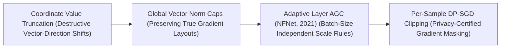
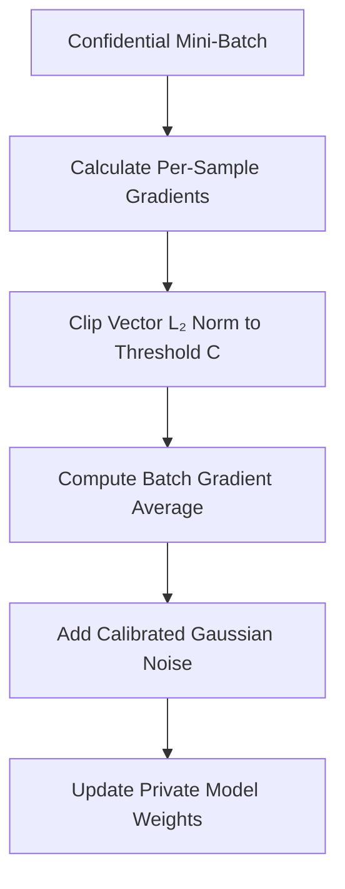

# Awesome-Gradient-Clipping
## Gradient Clipping in AI: History, Progression, Variants, & Applications

**Gradient Clipping** is a hardware-aware optimization and regularization paradigm designed to stabilize the training loops of deep neural networks by constraining the magnitude of backpropagated error gradients [INDEX: 16]. Originally conceptualized to resolve the catastrophic **exploding gradient problem** in Recurrent Neural Networks (RNNs), gradient clipping mathematically intercepts the parameter update step before weights are modified [INDEX: 16]. 

When individual or structural parameter gradients grow excessively large—often caused by processing long sequence contexts or navigating highly non-convex, steep cliffs on the loss landscape—gradient clipping forces them back down within a pre-defined maximum threshold. This prevents numerical overflow errors, blocks optimization loops from taking destructive weight adjustments, and serves as a mandatory safety gate for stabilizing web-scale foundational AI setups [INDEX: 11, 16].

---

## 1. The Macro Chronological Evolution

The technical methodology of gradient scaling has transitioned from rigid element-wise coordinate truncations to global structural vector norm caps, adaptive layer-wise normalization steps, and highly private noise-fused clipping boundaries.

*   **The Element-Wise Value Truncation Era (Traditional Recurrent Tuning, Pre-2012)**
    *   *Concept:* The core structural baseline engineered to tame exploding gradients in Early LSTMs and RNNs. Optimization frameworks evaluated gradients at the individual coordinate level: if an absolute gradient element exceeded a hardcoded threshold ($|g_i| > c$), it was forcibly truncated exactly to $c$ or $-c$.
    *   *Limitation:* Distorted the true direction of the gradient vector. Because elements were clipped independently, the overall geometric angle of the parameter update vector was altered, frequently routing the optimization path down sub-optimal local regions or causing training stagnation.
*   **The Global Vector Norm Capping Era (Pascanu et al., 2012–2020)**
    *   *Concept:* Dismantled direction distortion by introducing global vector norm constraints [INDEX: 16]. Razvan Pascanu et al. proved that scaling the *entire global gradient vector symmetrically* preserves the exact mathematical update direction [INDEX: 16]. If the total Euclidean norm ($L_2$) of the model's aggregated gradients crosses a maximum cap ($v$), the entire gradient matrix is downscaled proportionally, standardizing the optimization of deep transformers and vision networks.
*   **The Adaptive Layer-Wise Normalization Era (AGC / NFNet Class, ~2021–2023)**
    *   *Concept:* Addressed the fragility of manual, static global thresholds which fail when batch sizes or data densities scale dynamically. Frameworks like Brock et al.'s **Adaptive Gradient Clipping (AGC)** refactored clipping into a relative ratio task. It enforces a structural constraint: the norm of the layer-wise gradient vector cannot exceed a fixed fraction ($\lambda$) of the absolute norm of that layer's *existing parameter weights*.
    *   *Significance:* Unlocked the ability to train massive, high-speed vision architectures (like NFNets) completely free of Batch Normalization layers, eliminating data-synchronization stalls across cluster nodes.
*   **The Per-Sample Differential Privacy Era (DP-SGD, ~2024–Present)**
    *   *Concept:* The current modern state-of-the-art security and privacy baseline. It ports gradient clipping out of pure convergence optimization and straight into **provable cryptographic data protection**. In **Differentially Private Stochastic Gradient Descent (DP-SGD)**, clipping moves from the global batch down to the individual sample level.
    *   *Significance:* The backpropagation engine tracks and clips the gradient length of *each independent data row* to a maximum cap ($C$), blending in mathematically calibrated Gaussian noise before the weights update, completely neutralizing membership inference and data reconstruction attacks.

---

## 2. Core Functional & Mathematical Variants

Gradient Clipping frameworks are strictly categorized based on the specific geometric parameters and tensor granularities they clip during backpropagation.

- ### A. Clipping by Value (Element-Wise Truncation)
	*   **Mechanism:** Scans the gradient matrix coordinate-by-coordinate, clamping values to a strict minimum/maximum interval:
	    $$g_i = \max(\min(g_i, c_{\text{max}}), c_{\text{min}})$$
	*   **Cons:** Computationally trivial, but risks changing the directional orientation of multi-dimensional gradient matrices.

- ### B. Clipping by Global Norm ($L_2$ Cap)
	*   **Mechanism:** Evaluates the aggregate Euclidean norm ($|g|$) of the entire system's parameters globally. If the length crosses the targeted threshold $c$, it rescales the total gradient tensor symmetrically:
	    $$g \leftarrow g \times \frac{c}{\max(\|g\|_2, c)}$$
	*   **Pros:** The undisputed production standard for pre-training transformers, maintaining true search path angles perfectly [INDEX: 15, 16].

- ### C. Adaptive Gradient Clipping (AGC)
	*   **Mechanism:** Scales gradients relative to active weight tensors on a layer-by-layer basis. For layer $l$ with weights $W_l$ and gradients $G_l$, the clipping is evaluated as:
	    $$G_l \leftarrow G_l \times \frac{\lambda \frac{\|W_l\|_F^*}{\|G_l\|_F}}{\max\left(1, \lambda \frac{\|W_l\|_F^*}{\|G_l\|_F}\right)}$$
	    Where $\|\cdot\|_F$ maps the Frobenius norm and $\|W_l\|_F^* = \max(\|W_l\|_F, \epsilon)$.

- ### D. Per-Sample Privacy Clipping
	*   **Mechanism:** The operational link underpining DP-SGD infrastructure. Instead of averaging gradients across a mini-batch first, the engine isolates each data row's forward-backward pass, clipping individual gradient lengths before executing the global batch reduction step.

---

## 3. The Private Optimization Clipping Pipeline

To calculate per-sample gradient limits safely without destroying hardware processing velocities, private training engines execute vectorized compilation loops directly within GPU registers.

*   **Vectorized Opacus Kernels**
    *   *Profile:* Overcomes the per-sample memory bottleneck. Traditional machine learning code aggregates gradients instantly, losing track of individual rows. Specialized JIT-compilers (like PyTorch Opacus or custom Triton templates) use vectorized execution to calculate, clip, and accumulate sample-level gradient lengths concurrently entirely inside fast GPU SRAM.
*   **Global Norm Threshold ($\text{grad}\_\text{norm}$) Caching**
    *   *Profile:* Memory bus load balancing. In standard LLM pre-training sweeps, the accumulated global norm value is evaluated and cached as a single scalar tensor, executing the scaling division in a single hardware step across distributed data-parallel data nodes [INDEX: 22].

---

## 4. Production Engineering Challenges & Cluster Solutions

Deploying gradient clipping constraints across massive multi-node distributed training infrastructures introduces critical performance stalls and precision drops [INDEX: 22].

*   **The Distributed All-Reduce Communication Stale Wait**
    *   *The Problem:* To execute Global Norm Clipping safely, the system must calculate the total norm across the entire model portfolio. In **Fully Sharded Data Parallel (FSDP)** or distributed data-parallel configurations, this forces all GPUs to run a synchronous collective primitive (`All-Reduce`) to aggregate partial norm scalars, introducing network latency stalls that keep Tensor Cores idle [INDEX: 22].
    *   *Mitigation:* Implementing **Layer-Wise or Group-Wise Norm Clipping**, allowing independent GPU nodes to shard and scale localized parameter blocks asynchronously without waiting for global cluster wide barrier synchronization loops.
*   **The Low-Precision Gradient Underflow Hazard**
    *   *The Problem:* When executing pre-training loops using low-precision 16-bit floats (FP16 or BF16) [INDEX: 11], applying aggressive gradient clipping factors to tiny, long-tail parameter updates can cause values to drop beneath numerical limits, triggering **Underflow Errors** that zero out learning steps [INDEX: 11, 16].
    *   *Mitigation:* Deploying **Dynamic Loss Scaling (FP16 Mixed Precision)**, which multiplies the initial loss value by a large factor (e.g., $2^{16}$) prior to backpropagation to inflate gradient values into safe bit-precision zones, executing the clipping scale factors before dividing the scalar back to full 32-bit master weights [INDEX: 11].

---

## 5. Frontier Real-World AI Industrial Applications

*   **Pre-Training Trillion-Token Foundational LLM Backbones (Llama / DeepSeek)**
    *   *Application:* Serves as the critical baseline safety guard protecting distributed clusters from optimization divergence [INDEX: 15, 22]. During web-scale pre-training sweeps over trillions of uncurated tokens, encountering an anomalous, hyper-corrupted data batch can trigger extreme gradient spikes [INDEX: 15]; global norm clipping (typically locked at a threshold of $c=1.0$) intercepts the spike, preserving loss stability [INDEX: 16].
*   **Privacy-Certified Medical & Financial Foundational Fine-Tuning**
    *   *Application:* Optimizes models over highly sensitive enterprise data reservoirs (such as clinical pathology grids or personal transaction chains) [INDEX: 1]. Per-sample gradient clipping paired with Gaussian noise injection ensures the model internalizes macro patterns safely, guaranteeing certified differential privacy bounds ($\epsilon < 2$) to block membership inference hacks completely.
*   **High-Frequency Multi-Task Autonomous Perception Stacks**
    *   *Application:* Coordinates real-time navigation pipelines for autonomous vehicles [INDEX: 1]. Backpropagation loops process object tracking, lane segmentation, and depth calculations concurrently; adaptive layer-wise gradient clipping (AGC protocols) stabilizes multi-task optimization parameters, preventing a single high-loss task from over-correcting and erasing adjacent model capacities [INDEX: 1, 16].

---

## References
1. Pascanu, R., Mikolov, T., & Bengio, Y. (2012). On the difficulty of training recurrent neural networks. *International Conference on Machine Learning (ICML)*, 1359-1366 [INDEX: 16].
2. Abadi, M., et al. (2016). Deep learning with differential privacy: Per-sample gradient clipping architectures. *Proceedings of the 2016 ACM SIGSAC Conference on Computer and Communications Security*, 308-318.
3. Shoeybi, M., et al. (2019). Megatron-LM: Training multi-billion parameter language models using model parallel gradient clipping optimizations. *arXiv preprint arXiv:1909.08053*.
4. Brock, A., De, S., & Smith, S. L. (2021). High-performance large-scale image recognition without normalization via adaptive gradient clipping. *International Conference on Machine Learning (ICML)*.
5. Yousefpour, A., et al. (2021). Opacus: User-friendly vectorized differential privacy in PyTorch. *arXiv preprint arXiv:2109.12298*.
6. Zhao, Y., et al. (2023). PyTorch FSDP: Experiences on scaling foundational models via fully sharded data parallel architectures. *Proceedings of the VLDB Endowment*, 16(11) [INDEX: 22].

---

To advance this section of your repository, instructional testing pipeline, or distributed deployment blueprint, consider exploring these adjacent development pathways:
* Build a **Python code snippet using PyTorch (`torch.nn.utils.clip_grad_norm_`)** illustrating how to declare a standard linear optimization loop and apply an explicit global $L_2$ norm clipping threshold factor [INDEX: 16].
* Generate a **comprehensive Markdown table** explicitly comparing Gradient Clipping by Value, Global Norm Capping ($L_2$), Adaptive Gradient Clipping (AGC), and Per-Sample Privacy Clipping across mathematical time complexities, mini-batch alignment limits, risk of gradient direction distortion, and core operational targets [INDEX: 16].
* Establish an **automated performance profiling suite using PyTorch Profiler** to track the exact computational throughput, worker synchronization wait times, and memory bus latency metrics achieved when computing an enterprise pre-fill training pass over distributed server nodes [INDEX: 22].

***

**Follow-Up Options Matrix:**

Before updating this documentation layout, let me know how you would like to proceed by choosing one of the options below:
* I can provide a **complete Python code boilerplate using PyTorch** demonstrating how to write a manual global norm calculations gradient clipping function from scratch [INDEX: 16].
* I can generate a **Markdown matrix table** tracking the explicit gradient norm caps, learning rates, and precision scales utilized by leading foundation repositories to manage distributed data clusters [INDEX: 11, 22].
* I can write a detailed technical explanation focusing on the **mathematics of Rényi Differential Privacy accounting** and how per-sample clipping factors govern overall information leakage curves.

