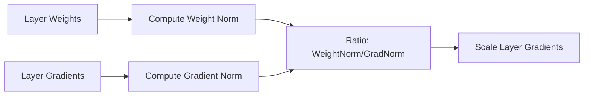

# The Adaptive Layer-Wise Normalization Era

Adaptive Gradient Clipping (AGC) allows scaling gradients relative to active weight tensors.

## Architecture Diagram

```mermaid
flowchart LR
    A[Layer Weights] --> B[Compute Weight Norm]
    C[Layer Gradients] --> D[Compute Gradient Norm]
    B & D --> E[Ratio: WeightNorm/GradNorm]
    E --> F[Scale Layer Gradients]
```

[Back to README](README.md)
