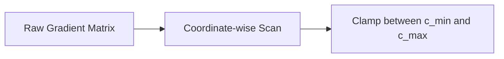

# A. Clipping by Value (Element-Wise Truncation)

Mechanisms and tradeoffs of clamping values to a strict minimum/maximum interval.

## Architecture Diagram

```mermaid
flowchart LR
    A[Raw Gradient Matrix] --> B[Coordinate-wise Scan] --> C[Clamp between c_min and c_max]
```

[Back to README](README.md)
