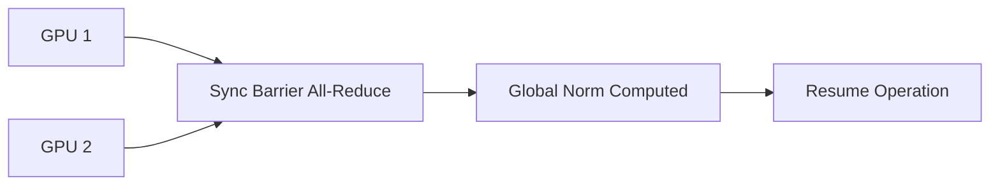

# The Distributed All-Reduce Communication Stale Wait

Understanding the sync barrier stalls in FSDP and distributed configurations.

## Architecture Diagram

```mermaid
flowchart LR
    A[GPU 1] --> C[Sync Barrier All-Reduce]
    B[GPU 2] --> C
    C --> D[Global Norm Computed]
    D --> E[Resume Operation]
```

[Back to README](README.md)
