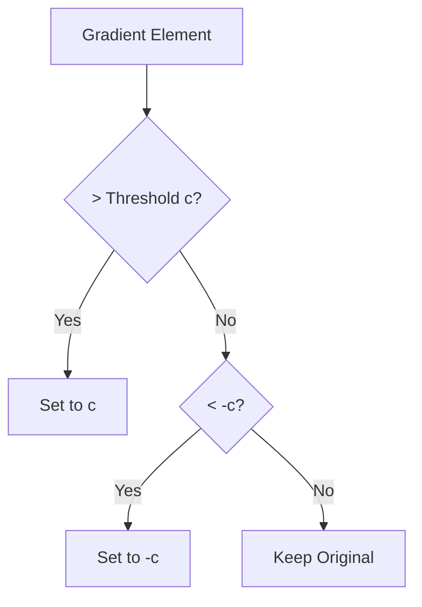

# The Element-Wise Value Truncation Era

A detailed look at the early days of gradient clipping using coordinate truncation.

## Architecture Diagram

```mermaid
flowchart TD
    A[Gradient Element] --> B{> Threshold c?}
    B -- Yes --> C[Set to c]
    B -- No --> D{< -c?}
    D -- Yes --> E[Set to -c]
    D -- No --> F[Keep Original]
```

[Back to README](README.md)
