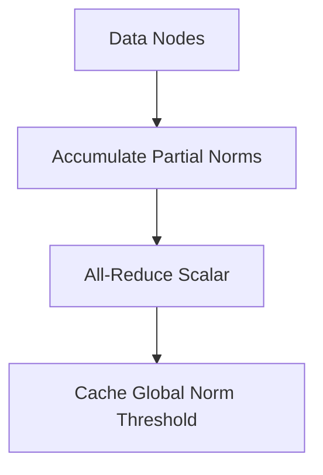

# Global Norm Threshold ($\text{grad}\_\text{norm}$) Caching

Memory bus load balancing and single scalar tensor caching.

## Architecture Diagram

```mermaid
flowchart TD
    A[Data Nodes] --> B[Accumulate Partial Norms]
    B --> C[All-Reduce Scalar]
    C --> D[Cache Global Norm Threshold]
```

[Back to README](README.md)
