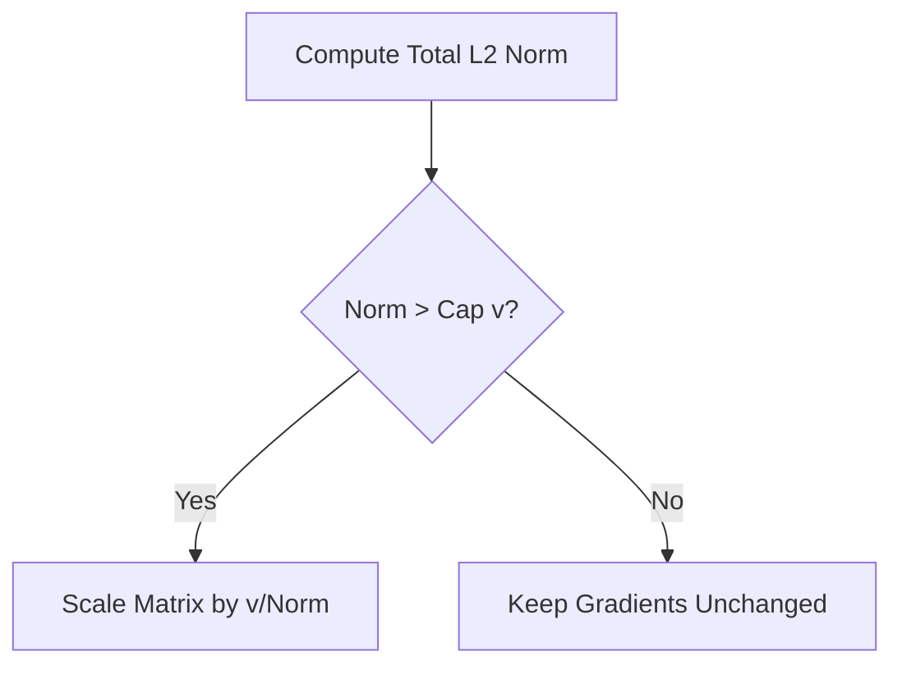

# The Global Vector Norm Capping Era

Exploring the transition to global vector norm constraints introduced by Pascanu et al.

## Architecture Diagram

```mermaid
flowchart TD
    A[Compute Total L2 Norm] --> B{Norm > Cap v?}
    B -- Yes --> C[Scale Matrix by v/Norm]
    B -- No --> D[Keep Gradients Unchanged]
```

[Back to README](README.md)
