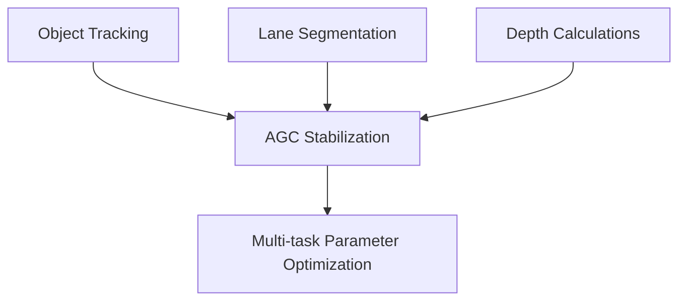

# High-Frequency Multi-Task Autonomous Perception Stacks

Coordinating real-time navigation pipelines for autonomous vehicles.

## Architecture Diagram

```mermaid
flowchart TD
    A[Object Tracking] --> D[AGC Stabilization]
    B[Lane Segmentation] --> D
    C[Depth Calculations] --> D
    D --> E[Multi-task Parameter Optimization]
```

[Back to README](README.md)
