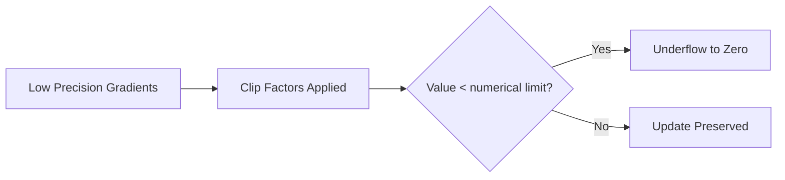

# The Low-Precision Gradient Underflow Hazard

Handling long-tail parameter update underflow in FP16/BF16 routines.

## Architecture Diagram

```mermaid
flowchart LR
    A[Low Precision Gradients] --> B[Clip Factors Applied]
    B --> C{Value < numerical limit?}
    C -- Yes --> D[Underflow to Zero]
    C -- No --> E[Update Preserved]
```

[Back to README](README.md)
