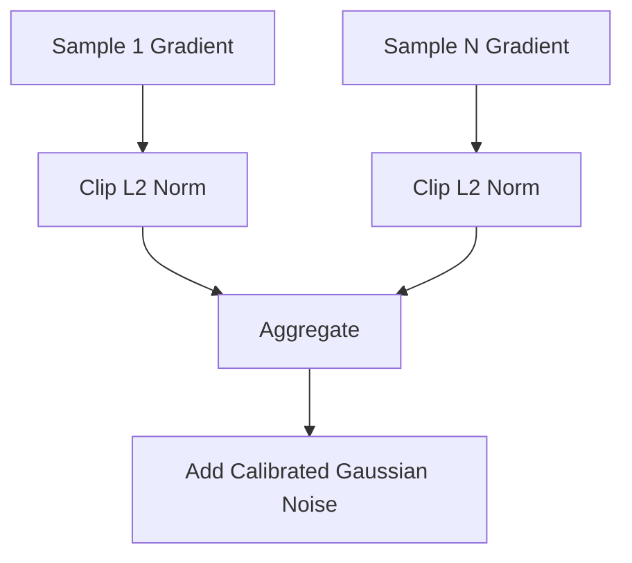

# The Per-Sample Differential Privacy Era

Incorporating differential privacy by moving clipping from global batch down to individual samples.

## Architecture Diagram

```mermaid
flowchart TD
    A[Sample 1 Gradient] --> B[Clip L2 Norm]
    C[Sample N Gradient] --> D[Clip L2 Norm]
    B & D --> E[Aggregate]
    E --> F[Add Calibrated Gaussian Noise]
```

[Back to README](README.md)
