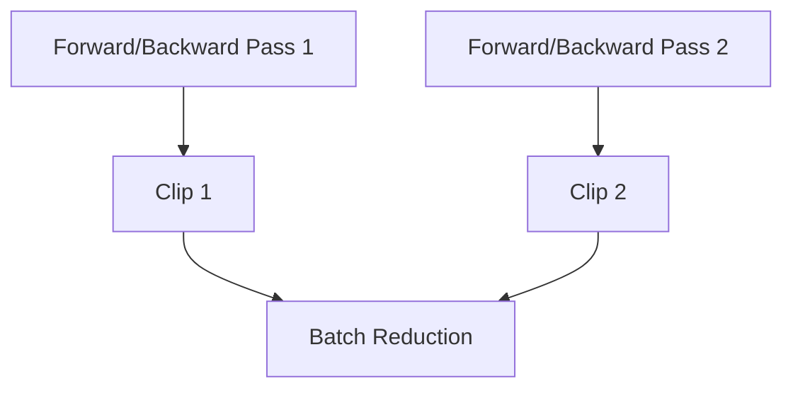

# D. Per-Sample Privacy Clipping

Isolating each data row's forward-backward pass to execute individual gradient clipping.

## Architecture Diagram

```mermaid
flowchart TD
    A[Forward/Backward Pass 1] --> B[Clip 1]
    C[Forward/Backward Pass 2] --> D[Clip 2]
    B & D --> E[Batch Reduction]
```

[Back to README](README.md)
