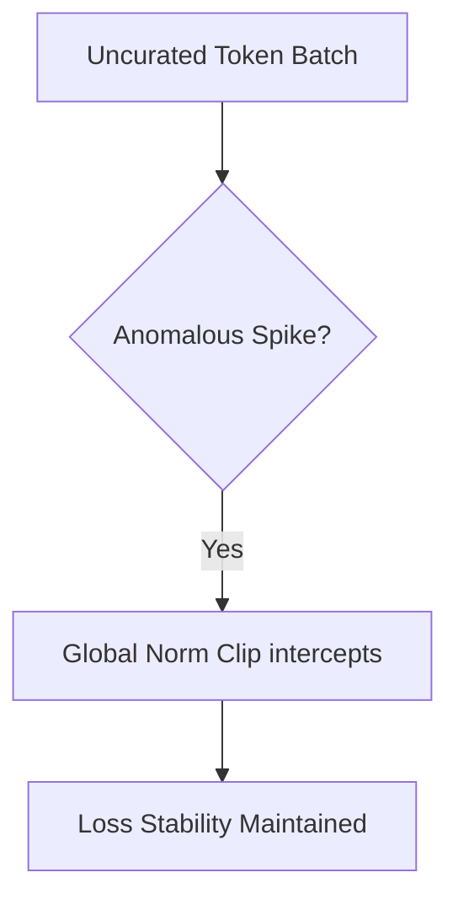

# Pre-Training Trillion-Token Foundational LLM Backbones (Llama / DeepSeek)

Baseline safety guards protecting distributed clusters from optimization divergence.

## Architecture Diagram

[Back to README](README.md)
