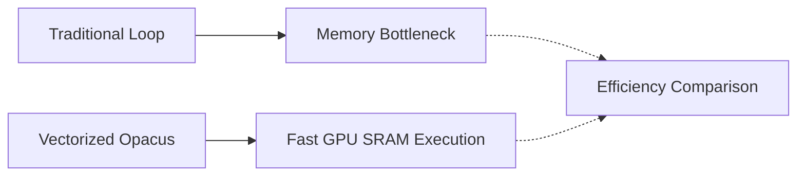

# Vectorized Opacus Kernels

Overcoming memory bottlenecks with specialized JIT-compilers like PyTorch Opacus.

## Architecture Diagram

```mermaid
flowchart LR
    A[Traditional Loop] --> B[Memory Bottleneck]
    C[Vectorized Opacus] --> D[Fast GPU SRAM Execution]
    B & D -.-> E[Efficiency Comparison]
```

[Back to README](README.md)
